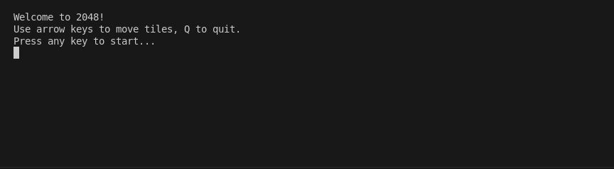
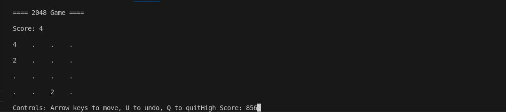
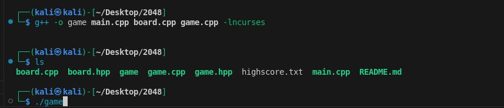

# 2048 Game in C++

## 🕹️ About the Project

This is a very simple **console-based** edition of the game **2048**, created in C++. In this game, a player moves the tiles using the **W/A/S/D** keys and adds the tiles of matching numbers until he gets to 2048. Score-based tracking is done in the game, which tells whether the player has won or lost.



## 🎮 How to Play

1. Run the program.
2. Use the following keys to move tiles:
   - **W** → Move **Up**
   - **A** → Move **Left**
   - **S** → Move **Down**
   - **D** → Move **Right**
   - **Q** → Quit the game
3. Try to reach **2048** before running out of moves!



---

## 🚀 Getting Started

### Prerequisites

Make sure you have **C++** installed on your system.

### Compiling the Code

If using **g++**:

```sh
g++ -o game main.cpp board.cpp game.cpp -lncurses
./game
```



---

## 📁 Project Structure

```
/2048-cpp
│── main.cpp      # Game entry point
│── board.hpp     # Board class header
│── board.cpp     # Board logic (grid, movement, merging)
│── game.hpp      # Game class header
│── game.cpp      # Game loop and user input
│── README.md     # Documentation (this file)
```

---

## 🛠️ Code Breakdown

### **Board Class (`board.cpp, board.hpp`)**

- **Handles the game grid** (4x4 matrix).
- Implements **tile movement (up, down, left, right)**.
- Checks for **valid moves, win/loss conditions**.
- Adds **random tiles (2 or 4) after each move**.

### **Game Class (`game.cpp, game.hpp`)**

- Runs the **game loop**.
- Accepts **user input (W/A/S/D/Q)**.
- Displays the **current board state**.
- Determines **game over & win conditions**.

### **Main (`main.cpp`)**

- Starts the game.
- Welcomes the player & takes input.
- Calls **`game.run()`** to begin the loop.

---

## 🏆 Winning the Game

To win, you need to **merge tiles until you reach 2048**.

Happy gaming! 🎮🔥
